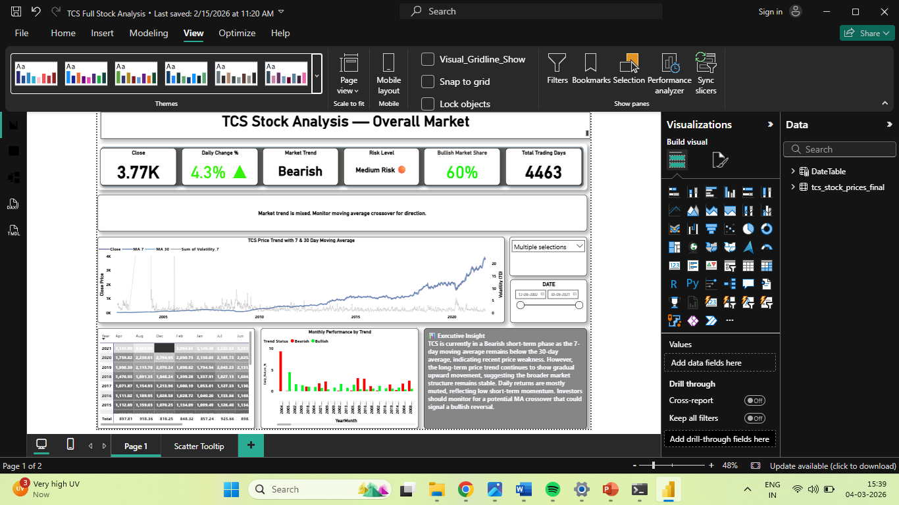

✦ Ritesh Deepak Mengade
   Data Analyst | Power BI | SQL | Excel | Python

📍 Mumbai, India  
📧 riteshmengade143@gmail.com  

✦ About Me
I am a Data Analyst with strong skills in Power BI, SQL, Excel, and Python. I hold the Microsoft Data Analyst Associate certification.
I specialize in building dashboards, analyzing data, and generating insights for better business decisions.

✦ Skills
 Power BI  
 SQL  
 Excel  
 Python  
 Data Cleaning  
 Data Visualization  

✦ Projects
1) 📈 TCS Stock Market Analysis

• Project Description
  Conducted a comprehensive analysis of Tata Consultancy Services (TCS) stock market data to understand price trends, trading patterns,
  and overall market performance. The objective of this project was to analyze historical stock price data and generate insights that       could support investment decision-making.

 ## Dashboard Preview
   

 • Key Responsibilities
- Collected and analyzed historical stock price data for TCS  
- Performed data cleaning and preprocessing to prepare the dataset for analysis  
- Analyzed stock price movements including opening, closing, high, and low prices  
- Identified trends and volatility patterns in the stock market data  
- Created visualizations to illustrate stock performance over time  

 • Key Insights
- Identified major fluctuations in TCS stock price over time  
- Observed patterns in trading volume and price changes  
- Highlighted periods of high market volatility  

 • Tools & Technologies Used
  Python  
  Pandas  
  Excel  
  Data Visualization  
  Time Series Analysis  

